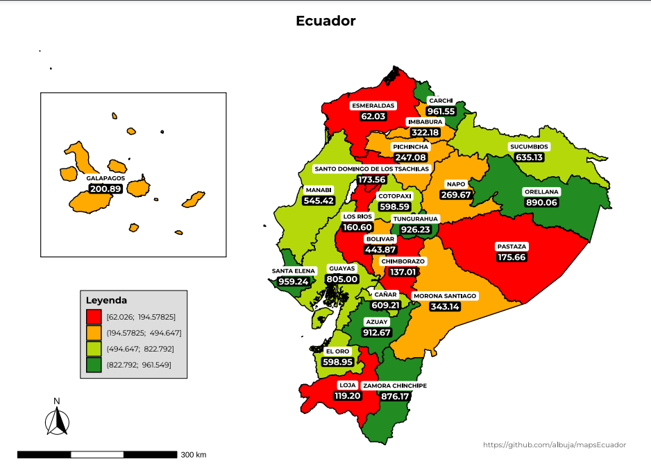

<!-- README.md is generated from README.Rmd. Please edit that file -->

# mapsEcuador

`mapsEcuador` R package provide simple functions to create printer ready PDF Ecuador maps with your own data over a full customizable template. 

No GIS knowledge is required. You need just provide data and geographic data will be internally added.

Internal base maps shape files were downloaded from:
https://www.ecuadorencifras.gob.ec//documentos/web-inec/Cartografia/Clasificador_Geografico/2012/SHP.zip

Installation
------------

You can install mapsEcuador R package from github with:

``` r
install.packages("devtools")
devtools::install_github("albuja/mapsEcuador")
```

Tips for newbies R Windows users:

1) Download R from https://cran.r-project.org/bin/windows/base/ and install it
2) Download RStudio from https://rstudio.com/products/rstudio/download/ and install it
3) Download Rtools from https://cran.r-project.org/bin/windows/Rtools/ and install it
4) Install `devtools` package using `install.packages("devtools")`
5) Install `mapsEcuador` package using `devtools::install_github("albuja/mapsEcuador")`
6) Enjoy it!

Example
--------

This is simplest code needed to get a printer ready PDF Ecuador choropleth map with your own data, using all function default values.

``` r
library(mapsEcuador)

# Ecuador choropleth map with dummy data

values <- round(runif(24, 10, 1000), 3)
names(values) <- 1:24
choropleth_map_prov_pdf(values)

```
 

